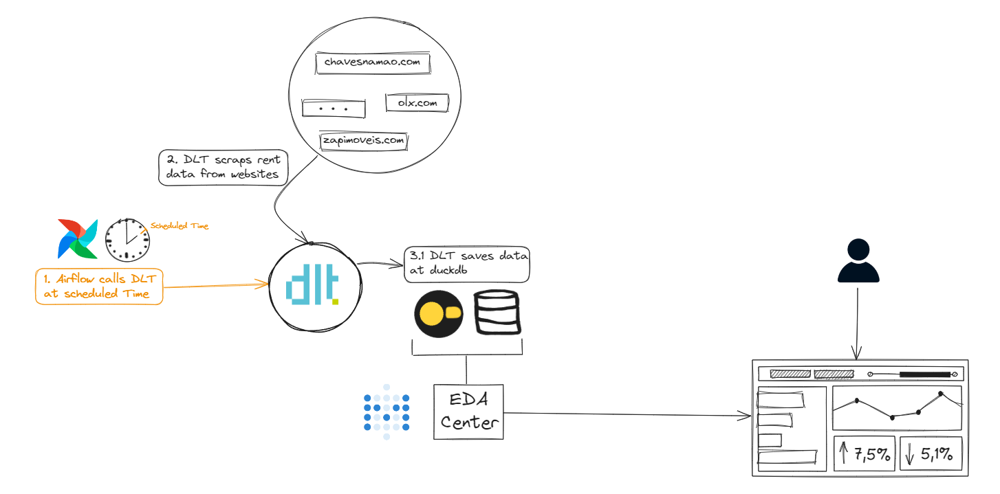

# Rent Warehouse Mania!

## Problema de Negócio
Este projeto visa aprimorar a eficácia na tomada de decisão ao escolher um novo imóvel para alugar. A ideia central é que a avaliação de se um aluguel está barato não pode ser baseada apenas na análise de um único site em um ponto específico no tempo. Essa afirmação ganha credibilidade quando consideramos aluguéis semelhantes de várias fontes e em momentos distintos.

## Ferramentas Utilizadas

### 1. Ingestão de Dados
Os dados estão sendo capturados usando a biblioteca open-source Python DLT.

### 2. Orquestração
A orquestração dos dados é realizada por meio do Airflow.

### 3. Armazenamento
Os dados são armazenados no DuckDB.

### 4. Análise Exploratória de Dados (EDA)
A análise dos dados é conduzida através do Metabase.

### 5. Alertas
Alertas são gerados usando Airflow em conjunto com o Telegram.

## Como Funciona

O projeto utiliza a biblioteca DLT para a ingestão eficiente de dados de diversas fontes. O Airflow orquestra esses dados, garantindo uma execução suave e eficaz. Os dados resultantes são armazenados de forma eficiente no DuckDB.

A análise exploratória de dados (EDA) é conduzida utilizando o Metabase, oferecendo insights valiosos para a tomada de decisões informadas sobre os aluguéis. Além disso, o sistema de alertas, implementado por meio do Airflow e Telegram, notifica os usuários sobre eventos relevantes.

## Arquitetura:

## Contato

Para dúvidas, sugestões ou colaborações, entre em contato pelo e-mail: [pedro.miyasaki@dhauz.com](mailto:seu_email@exemplo.com).

---